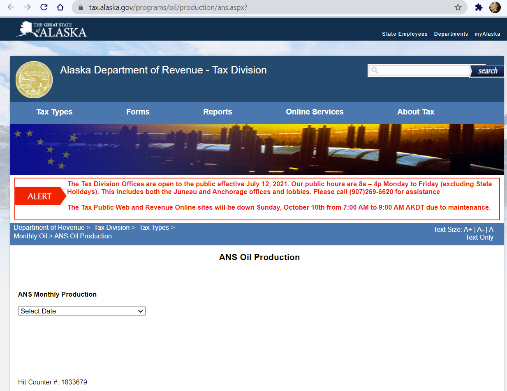
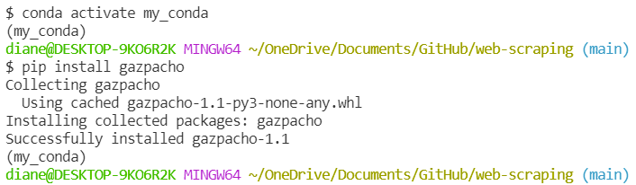
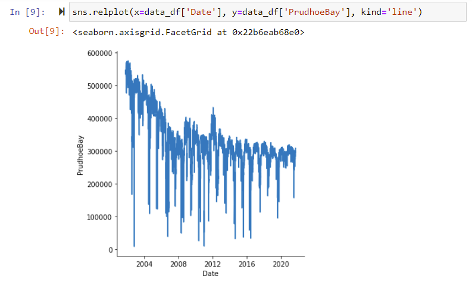

# Scraping Alaska Oilfield Production Data

**Background**
<!-- Project story: -->
- Scraping Alaska North Slope oil production from the State of Alaska Department of Revenue website, which publishes daily production volumes for select oilfields.
- Alaska oilfield production is a much-scrutinized dataset due to longrunning state taxation policy changes designed to increase daily production.

    **[State of Alaska, Department of Revenue - Tax Division](https://tax.alaska.gov/programs/oil/production/ans.aspx?)**

    

**Scope**
<!-- Project plan and tasks: -->
- Install gazpacho
    - Navigate to working folder
    - type  ```pip install gazpacho``` into the terminal

        

- Scrape_primary website for date options using Gazpacho

    [](https://github.com/maxhumber/gazpacho)
- Create a list of custom urls for each of the date options extracted above:
- Extract table data from each custom url using a for loop.
- Save the extracted data as a csv (or json, or...).
- Store the csv/json data on AWS?
- Read the csv with the scraped data into Pandas.

- Clean and explore data with Seaborn visualizations:

    

<!-- - Mission to Mars uses python, [Flask](https://flask.palletsprojects.com/en/2.0.x/), [PyMongo](https://pymongo.readthedocs.io/en/stable/index.html), and [MongoDB Atlas](https://pymongo.readthedocs.io/en/stable/atlas.html) (graded bootcamp assignment). -->

**Analysis**
<!-- Project statistics: -->
- None, yet.

<!-- |Table|Col1|Col2|
|----|----|----|
|1|2|3|4| -->

**Findings**
<!-- Project insights from data and process: -->
- Gazpacho was easier to use on the dropdown list (month and year options) than the table data.
- ```read_html``` was very easy to use to scrape, clean and transform this table data. 

**Conclusion**
<!-- Futher action, data exploration and limitations. -->
- Add headers to the csv file